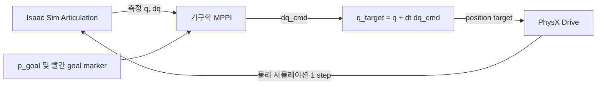

# MyCobot 기구학 기반 MPPI 중간보고

> 작성 기준: 2026-09-30 현재 `urop2_manipulator/mycobot` 구현  
> 목적: 현재 MPPI의 상태·입력·rollout·샘플링·비용함수·제약조건과 Isaac Sim 적용 구조를 한 문서에서 설명한다.

## 1. 현재 단계의 목표와 범위

현재 목표는 MyCobot 280의 end-effector를 지정한 한 점 `p_goal`로 이동시키는 것이다.
아직 동역학 기반 MPPI가 아니라 **관절 기구학 기반 MPPI**이며, 자세(orientation)나 기준
궤적 전체를 추종하지 않고 Cartesian 위치만 제어한다.

- 상태: 6개 관절 위치 `q [rad]`
- 제어 입력: 6개 관절 속도 명령 `u = dq_cmd [rad/s]`
- 목표: robot base frame 기준 flange 위치 `p_goal = [x, y, z] [m]`
- 제어 주기: `50 Hz`, 즉 `dt = 0.02 s`
- Isaac Sim 명령 방식: 매 주기 속도 명령을 한 스텝의 위치 target으로 변환하여 전달
- 현재 제외 범위: 관성, 중력, 마찰, 모터 지연, 토크 제한, EE 자세 추종, 장애물 회피

여기서 end-effector는 gripper 끝(TCP)이 아니라 **6번 관절 뒤 flange frame의 원점**이다.
향후 gripper/TCP를 기준으로 제어하려면 flange-to-tool 고정 변환을 FK 뒤에 추가해야 한다.

## 2. 전체 제어 구조



한 제어 주기마다 다음 순서가 반복된다.

1. Isaac Sim articulation에서 현재 `q`, `dq`를 읽는다.
2. MPPI가 현재 `q`에서 다수의 속도 명령열을 rollout하고 비용을 계산한다.
3. MPPI가 선택한 첫 속도 명령 `dq_cmd`만 꺼낸다.
4. `q_target = q_measured + 0.02 dq_cmd`를 계산한다.
5. 이 값을 articulation의 position target으로 보낸다.
6. PhysX를 20 ms 진행하고, 새 상태를 읽어 다시 최적화한다.

따라서 관절 상태를 순간이동(teleport)하지 않는다. MPPI가 직접 토크를 출력하는 것도
아니다. MPPI는 관절 속도를 결정하고, 실제 시뮬레이션에서는 PhysX Drive가 위치 target을
추종한다.

## 3. Rollout model

### 3.1 상태 전이

각 샘플의 예측에는 아래의 1차 적분 모델을 사용한다.

```text
q[t+1] = q[t] + dt * u[t]
u[t]   = dq_cmd[t]
dt     = 0.02 s
```

즉, MPPI 내부 rollout에서는 명령한 관절속도가 즉시 실현된다고 가정한다. 가속도,
질량·관성, 중력, 마찰, Drive gain과 추종 오차는 예측 모델에 포함하지 않는다.

### 3.2 Horizon

현재 기본값은 다음과 같다.

| 항목 | 값 | 의미 |
|---|---:|---|
| 제어 주기 `dt` | 0.02 s | 50 Hz |
| horizon step `H` | 10 | 미래 명령 10개 예측 |
| 예측 시간 `H × dt` | 0.20 s | 한 번의 최적화가 보는 미래 길이 |
| 실제 적용 명령 수 | 1 | 첫 명령만 적용 후 다시 최적화 |

예측 구간은 0.2초이지만 매 0.02초마다 현재 관절 상태를 다시 측정하는 receding-horizon
방식이다. 따라서 이전에 계획한 나머지 9개 명령을 그대로 실행하지 않고 다음 최적화의
초깃값으로 이동(shift)시킨다.

## 4. Forward kinematics

각 rollout 상태 `q[t]`에서 EE 위치를 계산하기 위해 standard DH 변환
`Rz(theta) Tz(d) Tx(a) Rx(alpha)`를 사용한다.

| joint | `a` (m) | `d` (m) | `alpha` | `theta offset` |
|---|---:|---:|---:|---:|
| 1 | 0 | 0.13156 | `pi/2` | 0 |
| 2 | -0.11040 | 0 | 0 | `-pi/2` |
| 3 | -0.09600 | 0 | 0 | 0 |
| 4 | 0 | 0.06462 | `pi/2` | `-pi/2` |
| 5 | 0 | 0.07318 | `-pi/2` | `pi/2` |
| 6 | 0 | 0.04860 | 0 | 0 |

DH 상수는 Elephant Robotics의 MyCobot 280 파라미터를 반영했다. MPPI 비용에서 사용하는
`p_ee(q)`는 이 FK의 최종 translation이다.

기본 goal은 임의의 Cartesian 좌표가 아니라 아래 관절 자세를 FK로 계산한 도달 가능한
점이다.

```text
q_goal    = [30, -20, -30, 0, 20, 0] deg
p_goal    = [194.36, 56.79, 309.06] mm
reference = MyCobot base frame / flange origin
```

MPPI 실행 중에는 같은 위치에 작은 빨간 구체 `/World/Markers/MppiGoal`을 표시해 WebRTC
화면에서도 목표를 확인할 수 있다. idle 상태에서는 숨겨지고 MPPI가 완료·중지되면 다시
숨겨진다.

## 5. MPPI sampling과 명령 갱신

실행 backend는 `pytorch_mppi.MPPI 0.9.1`이며 PyTorch/CUDA를 사용한다. 현재 샘플링
설정은 다음과 같다.

| 항목 | 기호 | 기본값 |
|---|---:|---:|
| 샘플 수 | `K` | 136 |
| horizon | `H` | 10 |
| 제어 차원 | `nu` | 6 |
| 온도 | `lambda` | 1.0 |
| noise 표준편차 | `sigma` | 0.65 rad/s |
| noise covariance | `Sigma` | `0.65^2 I_6` |
| 난수 seed | - | 7 |

한 번의 최적화에서 후보 제어열의 shape은 `K × H × 6 = 136 × 10 × 6`이다.

### 5.1 기본 샘플

명목 제어열 `U = [u_0, ..., u_(H-1)]` 주변에 Gaussian noise `epsilon_k`를 더해 후보를
만든다.

```text
V_k = clip(U + epsilon_k, u_min, u_max)
epsilon_k ~ N(0, Sigma)
```

각 후보 `V_k`를 기구학 모델로 rollout하고 전체 비용 `S_k`를 구한다. 낮은 비용의 샘플이
더 큰 가중치를 갖도록 한다.

```text
w_k = exp(-(S_k - min(S)) / lambda)
      / sum_j exp(-(S_j - min(S)) / lambda)

U <- U + sum_k w_k * epsilon_k
```

`lambda`가 작으면 소수의 최저비용 샘플에 집중하고, 크면 여러 샘플을 더 고르게 반영한다.
라이브러리는 위 사용자 정의 비용 외에 MPPI의 nominal-control/noise 보정항도 total cost에
포함한다.

### 5.2 DLS guided proposal

순수 무작위 샘플만으로 Cartesian 점 목표를 찾을 때 생기는 sample degeneracy를 줄이기
위해 전체 136개 중 한 개를 damped least-squares(DLS) Cartesian servo로 만든다.

```text
dq = J(q)^T [J(q)J(q)^T + 0.02^2 I]^-1 * 2(p_goal - p_ee)
```

이 trajectory도 특별히 강제로 채택하지 않는다. 다른 후보와 동일한 비용함수로 평가한 뒤
MPPI 가중치에 따라 반영된다. 나머지 rollout과 비용 계산은 GPU에서 수행하며, 작은 수치
Jacobian 계산은 CPU에서 수행한다.

### 5.3 Receding horizon

최적화 후 `U[0]`만 실제 명령으로 출력한다. 다음 제어 주기에는 다음과 같이 기존 해를
한 칸 이동시켜 warm start한다.

```text
U[0] <- 이전 U[1]
...
U[H-2] <- 이전 U[H-1]
U[H-1] <- 0
```

## 6. 비용함수

예측된 상태를 `q_t`, 명령을 `u_t`, 위치 오차를
`e_t = p_ee(q_t) - p_goal`, 거리 오차를 `d_t = ||e_t||`라고 하면 현재 running cost는
개념적으로 다음과 같다.

```text
l_t = 180 ||e_t||^2
    + 0.025 ||u_t||^2
    + 1[t=0] 0.06 ||u_0 - u_previous||^2
    + 1000 C_joint(q_t)
    + 2500 C_self(q_t)
    + 1.5 exp(-(d_t / 0.060)^2) ||u_t||^2

terminal_cost = 900 ||p_ee(q_H) - p_goal||^2
```

최종 샘플 비용은 horizon의 running cost 합, terminal cost, 그리고 `pytorch_mppi`
라이브러리의 MPPI perturbation 보정항을 합한 값이다.

| 비용항 | weight | 목적 및 동작 |
|---|---:|---|
| EE 위치 오차 | 180 | horizon 전체에서 goal에 가까운 rollout 선호 |
| Terminal 위치 오차 | 900 | horizon 마지막 위치를 더 강하게 평가 |
| 입력 크기 | 0.025 | 불필요하게 큰 관절속도 억제 |
| 명령 변화 | 0.06 | 현재 첫 명령과 직전 실제 명령의 급격한 변화 억제 |
| 관절 한계 | 1000 | 관절 한계 5도 전부터 soft penalty 부여 |
| Self-collision | 2500 | 비인접 link sphere 간 겹침 억제 |
| Goal 근처 정지 | 1.5 | 60 mm 안에서 속도 비용을 점차 증가 |

모든 위치 값은 m, 관절은 rad, 속도는 rad/s 기준이다. 각 항의 단위가 서로 다르므로
weight는 물리 상수가 아니라 현재 시뮬레이션에서 상대적 우선순위를 정한 경험적 값이다.

### 6.1 관절 한계 비용

실제 한계에서 5도 안쪽을 safe range로 정의하고 그 범위를 벗어난 양의 제곱을 더한다.

```text
q_safe_min = q_min + 5 deg
q_safe_max = q_max - 5 deg

C_joint = sum_i [ReLU(q_safe_min_i - q_i)^2
               + ReLU(q_i - q_safe_max_i)^2]
```

### 6.2 Self-collision 비용

정확한 mesh distance 대신 base와 각 DH origin에 총 7개의 구를 놓는 빠른 근사를 쓴다.

```text
radii = [45, 40, 35, 33, 30, 27, 25] mm
clearance = 12 mm
penetration_ij = ReLU(r_i + r_j + clearance - distance_ij)
C_self = sum_(i,j) penetration_ij^2
```

평가 pair는 인접 frame을 제외한
`(0,3), (0,4), (0,5), (0,6), (1,4), (1,5), (1,6), (2,5), (2,6), (3,6)`이다.
이는 명백한 arm-on-arm 자세를 줄이는 근사 비용이지, 정확한 충돌 판정이나 실기 안전
보장을 의미하지 않는다.

### 6.3 Goal 근처 감속과 정지

감속은 비용과 최종 출력 후처리 두 곳에 적용된다.

- 비용: `exp(-(d/0.060)^2) ||u||^2`로 goal에 가까울수록 큰 속도를 불리하게 만든다.
- 출력: `d < 60 mm`이면 `dq_out = dq_raw * d/60 mm`로 선형 감속한다.
- 정지: `d <= 5 mm`이면 `dq_out = 0`으로 만든다.

예를 들어 오차가 30 mm이면 MPPI가 출력한 속도의 50%만 적용한다. 이 후처리는 optimizer가
예측하는 rollout 자체에는 포함되지 않으므로, 향후 정밀 튜닝 시 일치 여부를 재검토해야
한다.

## 7. 제약조건 정리

현재 hard constraint와 soft constraint는 다음과 같이 구분된다.

| 대상 | 종류 | 현재 처리 |
|---|---|---|
| 관절속도 | Hard | 모든 sampled/action output을 `±2.0944 rad/s`로 clamp |
| 최종 정지 | Hard 후처리 | EE 오차 5 mm 이하에서 `dq_cmd = 0` |
| 관절 위치 한계 | Soft + runtime clamp | rollout은 penalty만 사용, Isaac target은 joint limit으로 clamp |
| Self-collision | Soft | DH-origin sphere penalty 사용 |
| Goal 근처 속도 | Soft + 출력 scaling | 비용항과 60 mm 이내 선형 scaling |
| 환경 장애물 | 없음 | 현재 비용에 포함되지 않음 |
| 토크·가속도 | 없음 | 현재 기구학 rollout에서는 모델링하지 않음 |

관절별 위치 범위는 다음과 같다.

```text
q_min = [-2.9321, -2.4434, -2.6179, -2.6179, -2.7052, -3.14159] rad
q_max = [ 2.9321,  2.4434,  2.6179,  2.6179,  2.7925,  3.14159] rad
```

속도 상한 `2.0944 rad/s = 120 deg/s`는 모든 관절에 동일하게 적용한 시뮬레이션용
잠정값이다. 원본 URDF의 일부 velocity limit가 0이어서 그대로 사용할 수 없었다. 실제
로봇이 도착하면 정확한 모델·firmware·payload 조건에 맞는 관절별 제한으로 교체해야 한다.

중요하게도 production Torch rollout의 `q[t+1]` 자체는 joint limit으로 hard clamp하지
않는다. 일반 샘플에는 관절 한계 soft penalty만 적용되고, DLS proposal 작성 과정과
Isaac에 전달하는 최종 position target에는 clamp가 적용된다.

## 8. Isaac Sim/PhysX와의 연결

MPPI 출력 `dq_cmd`를 Isaac Sim에 직접 velocity target으로 주지 않고 다음 position target으로
변환한다.

```text
q_target = q_measured + 0.02 * dq_cmd
```

PhysX position Drive는 현재 다음 PD gain으로 이 target을 추종한다.

```text
Kp = [120, 120, 100, 80, 50, 30]
Kd = [  4,   4, 3.5,  3,  2, 1.5]
```

현재 scene은 기구학 MPPI와 조건을 맞추기 위해 중력을 0으로 두고 physics/control을 모두
50 Hz로 실행한다. 따라서 “MPPI rollout의 다음 상태”와 “PhysX가 실제 도달한 다음 상태”는
Drive 추종 지연 때문에 다를 수 있다. 다만 매 주기 실제 `q`를 다시 읽어 폐루프로 보정한다.

WebRTC 렌더링은 기본적으로 매 control cycle 수행한다(`render_every=1`). MPPI 계산이
20 ms 이내여도 렌더링과 PhysX를 포함한 전체 cycle이 20 ms를 넘을 수 있으며, 이는 MPPI
solve 성능과 별도로 기록한다.

## 9. 실행 중 기록하는 진단값

각 실행은 다음 값을 step별로 기록하고, 정상 완료 시 `results/`에 PNG, NPZ, JSON으로
저장한다.

- EE 위치 오차와 실제 `q`, `dq`, `dq_cmd`
- preprocess, MPPI solve, postprocess, controller command 시간
- 렌더링과 PhysX를 포함한 전체 cycle 시간 및 real-time factor
- minimum sampled cost
- predicted terminal error
- effective sample size(ESS)

ESS는 `1 / sum(w_k^2)`이며 현재 설정에서는 이론적으로 1부터 136 사이다. 1에 가까우면
거의 한 샘플에 가중치가 집중된 상태이고, 136에 가까우면 모든 샘플의 가중치가 비슷한
상태다. ESS와 terminal error를 함께 보면 sample 수, noise, `lambda`, horizon 조정 필요성을
판단할 수 있다.

가장 최근 저장된 1000-step 실행의 timing 예시는 다음과 같다. 이 값은 MPPI 구조의 고정
성능이 아니라 해당 goal, WebRTC 렌더 설정, GPU 상태에 따른 한 번의 측정값이다.

| 지표 | 측정값 |
|---|---:|
| GPU | NVIDIA GB10 |
| 평균 MPPI command | 18.44 ms |
| 95 percentile | 19.35 ms |
| 최악 command | 24.77 ms |
| 20 ms deadline miss | 11 / 1000 |

## 10. 구현 파일 구성

| 파일 | 역할 |
|---|---|
| `controllers/kinematics.py` | DH FK와 numerical position Jacobian |
| `controllers/mppi.py` | 공통 설정, NumPy reference MPPI, 관절/속도 상수 |
| `controllers/torch_mppi.py` | 실제 실행용 `pytorch_mppi`/CUDA controller |
| `runtime/control_session.py` | Isaac 상태 읽기, MPPI 호출, target 적용, 결과 기록 |
| `runtime/isaac_robot.py` | Articulation과 Drive 설정, position target clamp |
| `runtime/goal_marker.py` | `p_goal` 빨간 구체 표시 |
| `scripts/run_mppi.py` | standalone MPPI 실행 entry point |
| `remote/start_mppi_control.py` | WebRTC가 열린 persistent Isaac에서 원격 실행 |
| `runtime/mppi_results.py` | 실행 결과 PNG/NPZ/JSON 저장 |

`controllers/mppi.py`의 NumPy 구현은 비교·오프라인 검증용이다. 현재 Isaac 제어에서 실제
사용하는 production 경로는 `controllers/torch_mppi.py`이다. 두 구현은 큰 구조는 같지만,
production Torch 구현의 smoothness 비용은 horizon 전체의 인접 명령 차이가 아니라 현재
첫 명령과 직전 실제 명령 사이에만 적용된다.

## 11. 현재 해석 시 주의점과 다음 단계

현재 구현으로 확인할 수 있는 것은 “기구학적으로 도달 가능한 위치에 대해 MPPI가 관절
속도 명령을 생성하고, Isaac articulation이 이를 반복 추종하는가”이다. 아직 실제 로봇의
동역학·안전 성능을 검증하는 단계는 아니다.

다음 항목은 후속 작업에서 확인 또는 개선해야 한다.

- DH FK의 flange 위치와 USD articulation의 실제 flange transform 정량 비교
- goal 도달 오차, ESS, deadline miss를 기준으로 `K`, `H`, `sigma`, `lambda`, weight 튜닝
- rollout에도 joint-position hard constraint를 적용할지 결정
- sphere 근사를 mesh/capsule 기반 self-collision으로 개선
- 환경 장애물 collision cost 추가
- EE orientation 및 실제 gripper TCP 제어 추가
- 관절별 실제 속도·가속도 제한 반영
- 실기 도입 후 actuator delay, gravity, friction, Drive/servo gain을 포함한 모델 검토
- 중력을 복원하고 physics substep을 늘린 동역학 검증

현재 단계에서는 gain 튜닝 완료를 기다리지 않고 기구학 MPPI의 구조와 비용함수 실험을
진행할 수 있다. 다만 실기 또는 동역학적으로 정확한 시뮬레이션으로 넘어갈 때는 위 모델
차이를 반영하고 다시 검증해야 한다.
